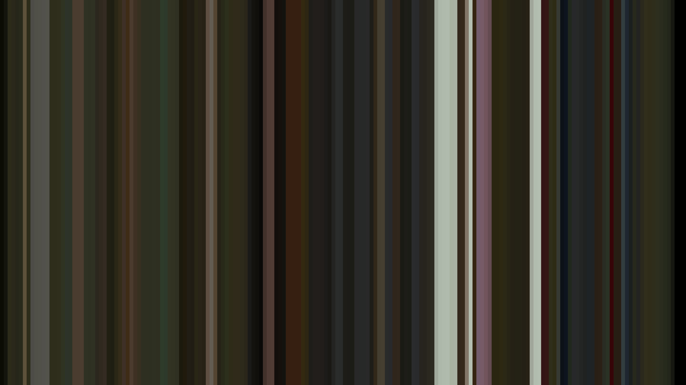
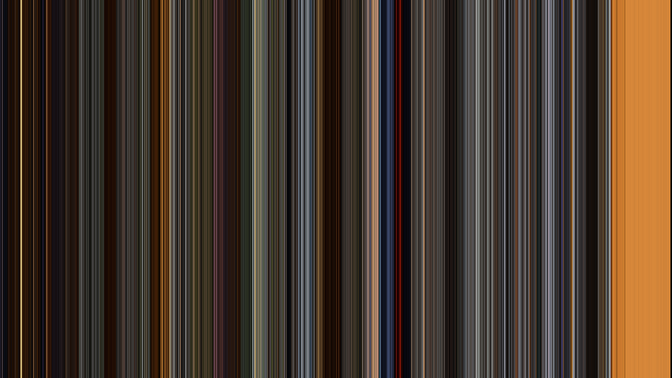
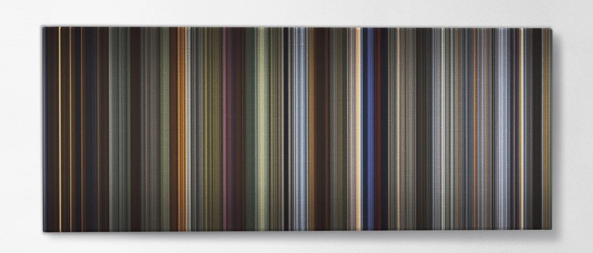
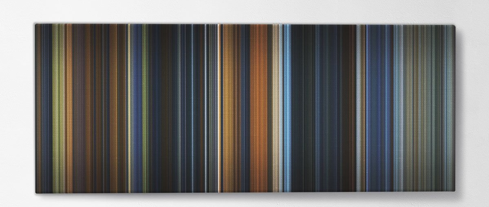

# MovieBarcodes
This project was inspired by the [Fromes](https://www.frome.co/) website/service.

However, since I didn't want to pay $200+ on their prints, I figured I'd see if I could do it myself and print the resulting image for much cheaper.

## From their website
- [How it works](https://www.frome.co/pages/how-it-works)

The canvases you see are movies condensed into chronological color strips that represent each frame - 
meaning the colors you see can roughly represent the main color of that scene. 
The movie begins with a single color strip at the start of canvas (left) and ends with the last 
strip (right). You can see how beautiful movies are in terms of colors!

## How this works
1. Use ffmpeg to split a video into it's frames
2. Using the sklearn python library to determine the most common color in each image.
3. Using numpy to gather said images and display them in order

### Packages necessary
- ffmpeg
- python2.7
	- opencv-python: `pip install opencv-python==4.2.0.32`
	- scikit-learn: `pip install scikit-learn`
	- watchdog: `pip install watchdog`

### Command line arguments
- `-c`: clean. Deletes generated image files and directory. Recommended for large video files to preserve disk space.
	- default: `False`
- `-d <directory>`: Image Directory. When used with `-i`, directory in which generated images are stored. Otherwise, the directory used to find images. Images must be in the following format: `img%05d.jpeg`.
	- default: `tmp`
- `-h`: Help. Shows the help command
- `-i <in_file>`: Input. Video file to generate from. Passed to ffmpeg for processing. If not given, attempts to use images in directory provided by `-d`. If file ends with .csv, loads the saved image details for re-processing.
	- default: `None`
- `-o <out_file>`: Output. File to output generated image. Also creates a file named <out_file>.csv that allows creation of new resolutions without re-scanning the media.
	- default: `out.png`
- `-q <resolution>`: Image Quality. Uses standard resolutions: 240, 360, 480, 720, 1080, 4000, 8000.
	- default: `1080`
- `-r <rate>`: Frames per second. Passed to ffmpeg with the -r parameter. Recommend using 1 for large videos. When excluded ffmpeg uses the fps of the video clip (usually 24).
	- default: `None`
- `-s`: Show. Whether or not to display the image after program is complete. Exit image with any key press.
	- default: `False`
- `-t <num_threads>`: Threads. Number of worker threads to process images. 
	- default: `1`
- `-l <length>`: Length in inches. Override the length of the resolution. Resolution at 300dpi.
- `-w <width>`: Width/Height in inches. Override the width of the resolution. Resolution at 300dpi.

## Examples

### Extracting using a file - [glip_glops.mp4](example-videos/glip_glops.mp4)
- Extract at video's fps and generate image at 8k resolution:
	-  `./mov-bar.py -i example-videos/glip_glops.mp4 -o example-images/glip_glops_8k.png -q 8000`

- Extract at 1 fps at 8k resolution: 
	- `./mov-bar.py -i example-videos/glip_glops.mp4 -o example-images/glip_glops_1fps_8k.png -q 8000 -r 1`

### Quality at different fps [Man or Muppet music video](https://www.youtube.com/watch?v=cRTjksM3YAs)
- Extracted at video's fps at 8k resolution

- Extracted at 1fps at 8k resolution

- Extracted at .5 fps (1 frame every 2 seconds) at 8k resolution

### Comparison to Fromes.co
These images are generated at 1fps at 480p resolution. Below them you will find the Fromes.co store version.
In practice you would use a higher resolution, but the images are too big to store here in this manner.
The code with each image will produce an 8k resolution image from the csv save files for your viewing.

- How to Train your Dragon
	- `./mov-bar.py -i example-csv/h2tyd_1fps.csv -o h2tyd_1fps_8k.png -q 8000`

- [How to Train your Dragon - FROME Comparison](https://www.frome.co/products/how-to-train-your-dragon)

- Lord of the Ring: Fellowship of the Ring
	- `./mov-bar.py -i example-csv/fotr_1fps.csv -o fotr_1fps_8k.png -q 8000`

- [Lord of the Rings: Fellowship of the Ring - FROME Comparison](https://www.frome.co/products/the-lord-of-the-rings-tfotr)

### Other examples files
- fotr_p5fps.png.csv: Fellowship of the Ring @ .5fps
- esb_1fps.png.csv: The Empire Srikes Back @ 1fps

#### Google Drive
Many images and csvs are stored in [google drive](https://drive.google.com/drive/folders/1Iu0MIg0koF0Oe830k3Faq0dCsUtdG5EL?usp=sharing) due to space restrictions

