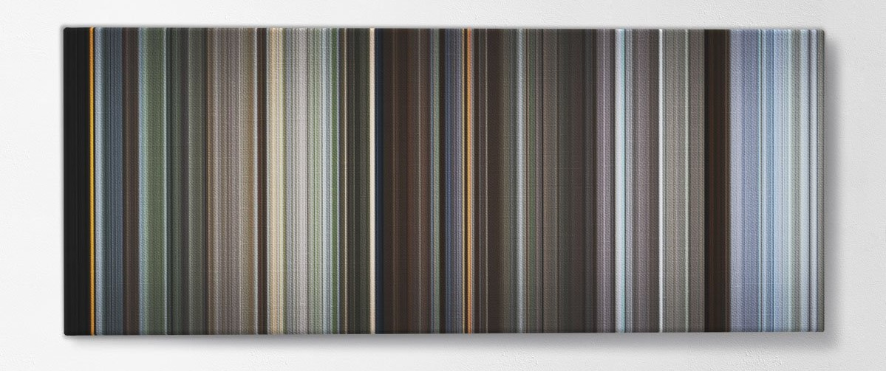

# Fromes
This project was inspired by the [Fromes](https://www.frome.co/) website/service.

However, since I didn't want to pay $200+ on their prints, I figured I'd see if I could do it myself and print the resulting image for much cheaper.

## From their website
- [How it works](https://www.frome.co/pages/how-it-works)

The canvases you see are movies condensed into chronological color strips that represent each frame - 
meaning the colors you see can roughly represent the main color of that scene. 
The movie begins with a single color strip at the start of canvas (left) and ends with the last 
strip (right). You can see how beautiful movies are in terms of colors!

## How this works
1. Use ffmpeg to split a video into it's frames
2. Using the sklearn python library to determine the most common color in each image.
3. Using numpy to gather said images and display them in order

### Packages necessary
- ffmpeg
- python2.7
	- opencv-python: `pip install opencv-python==4.2.0.32`
	- scikit-learn: `pip install scikit-learn`
	- watchdog: `pip install watchdog`

### Command line arguments
- `-c`: clean. Deletes generated image files and directory. Recommended for large video files to preserve disk space.
	- default: `False`
- `-d <directory>`: Image Directory. When used with `-i`, directory in which generated images are stored. Otherwise, the directory used to find images. Images must be in the following format: `img%05d.jpeg`.
	- default: `frome_images`
- `-h`: Help. Shows the help command
- `-i <in_file>`: Input. Video file to generate from. Passed to ffmpeg for processing. If not given, attempts to use images in directory provided by `-d`
	- default: `None`
- `-o <out_file>`: Output. File to output generated image.
	- default: `out.png`
- `-q <resolution>`: Image Quality. Uses standard resolutions: 240, 360, 480, 720, 1080, 4000, 8000.
	- default: `1080`
- `-r <rate>`: Frames per second. Passed to ffmpeg with the -r parameter. Recommend using 1 for large videos. When excluded ffmpeg uses the fps of the video clip (usually 24).
	- default: `None`
- `-s`: Show. Whether or not to display the image after program is complete. Exit image with any key press.
	- default: `False`
- `-t <num_threads>`: Threads. Number of worker threads to process images. 
	- default: `1`
- `-l <length>`: Length. Override the length of the resolution
- `-w <width>`: Width. OVerride the width of the resolution

## Examples
- [glip_glops.mp4](example-videos/glip_glops.mp4): `./frome.py -i example-videos/glip_glops.mp4 -d tmp -o example-images/glip_glops.png -q 8000 -t 10`

- [glip_glops.mp4 - 1 fps](example-videos/glip_glops.mp4): `./frome.py -i example-videos/glip_glops.mp4 -d tmp -o example-images/glip_glops_1fps.png -q 8000 -t 10 -r 1`

- [Man or Muppet music video](https://www.youtube.com/watch?v=cRTjksM3YAs)

- [Man or Muppet music video - 1fps](https://www.youtube.com/watch?v=cRTjksM3YAs)

- [Man or Muppet music video - 0.5fps](https://www.youtube.com/watch?v=cRTjksM3YAs)

- Star Wars: Empire Strikes Back - 1fps

- [Monty Python & the Holy Grail - 1fps](https://www.youtube.com/watch?v=PxagJ8fpsv8)

- [Monty Python & the Holy Grail - FROME Comparison](https://www.frome.co/products/monty-python-and-the-holy-grail)

